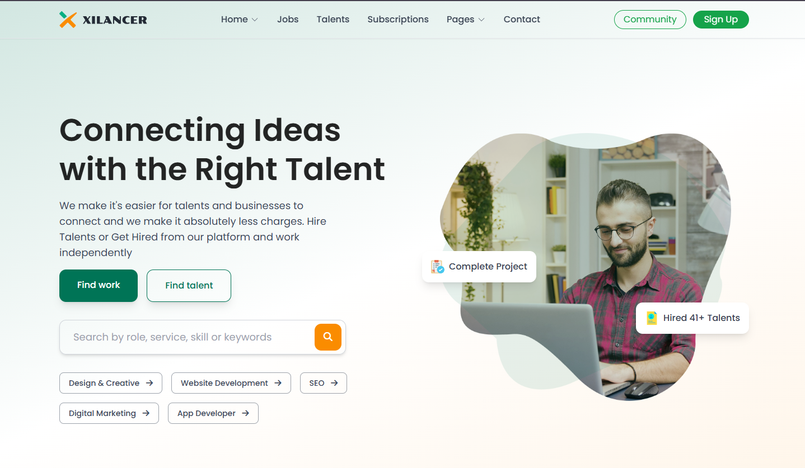

# 💼 Xilancer

> **Your Gateway to Global Freelancing Talent**

Xilancer is a modern, responsive freelancing platform that connects businesses with skilled freelancers from around the world. Built with cutting-edge web technologies, it provides a seamless experience for hiring professionals across various skill categories.

## Screenshots
### 01


### 02


## Technologies

[](https://mdmhrz.github.io/xilancer/assets)
[](https://html.spec.whatwg.org/)
[](https://www.w3.org/Style/CSS/)
[](https://tailwindcss.com/)
[](https://jquery.com/)
[](https://greensock.com/)

## 🌟 Features

- **🔍 Skill-Based Search**: Find freelancers by specific skills and expertise
- **💼 Diverse Categories**: Web development, design, writing, marketing, and more
- **📱 Responsive Design**: Optimized for all devices and screen sizes
- **🎨 Modern UI/UX**: Clean, intuitive interface with smooth animations
- **⚡ Fast Performance**: Optimized loading times and interactive elements
- **🎭 Smooth Animations**: Enhanced user experience with GSAP animations

## 🚀 Live Demo

**🌐 [Visit Xilancer](https://mdmhrz.github.io/xilancer/)**

Experience the platform in action and explore all the features firsthand.

## 🛠️ Tech Stack

| Technology | Purpose | Version |
|------------|---------|---------|
| **HTML5** | Structure & Semantics | Latest |
| **CSS3** | Styling & Layouts | Latest |
| **TailwindCSS** | Utility-First Styling | 3.x |
| **jQuery** | DOM Manipulation & Events | 3.x |
| **GSAP** | Animations & Interactions | 3.x |

## 📁 Project Structure

```
xilancer/
├── index.html
    ├── style.css
    ├── assets/
    └── scripts/
        ├── animation.js
        ├── browseCategroies.js
        ├── header.js
        ├── latestJobs.js
        ├── popularCategories.js
        ├── popularServices.js
        ├── pricing.js
        ├── testimonials.js
        ├── topRatedFreelancers.js
        └── trendingServices.js
```

## 🎯 Key Sections

### 🏠 **Homepage**
- Eye-catching hero section
- Featured freelancer profiles
- Popular skill categories
- Client testimonials

### 👥 **Freelancer Profiles**
- Detailed skill showcases
- Portfolio galleries
- Rating and review systems
- Contact information

### 📊 **Categories**
- **Web Development**: Frontend, Backend, Full-stack
- **Design**: UI/UX, Graphic Design, Logo Design
- **Content**: Writing, Translation, SEO
- **Marketing**: Digital Marketing, Social Media
- **And many more...**

## 🚀 Quick Start

1. **Clone the repository**
   ```bash
   git clone https://github.com/yourusername/xilancer.git
   cd xilancer
   ```

2. **Open in browser**
   ```bash
   # Simply open index.html in your preferred browser
   open index.html
   ```

3. **For development**
   ```bash
   # Use a local server for better development experience
   npx serve .
   # or
   python -m http.server 8000
   ```

## 🎨 Customization

### TailwindCSS Configuration
The project uses TailwindCSS for styling. You can customize the design system by modifying the Tailwind configuration:

```css
/* Add custom colors, fonts, or spacing */
@tailwind base;
@tailwind components;
@tailwind utilities;

/* Custom component classes */
.btn-primary {
  @apply bg-blue-600 hover:bg-blue-700 text-white font-semibold py-2 px-4 rounded;
}
```

### GSAP Animations
Animations are handled by GSAP for smooth, performant transitions:

```javascript
// Example animation
gsap.from(".hero-text", {
  duration: 1,
  y: 50,
  opacity: 0,
  ease: "power2.out"
});
```

## 📱 Responsive Design

Xilancer is fully responsive and optimized for:
- 📱 **Mobile devices** (320px+)
- 📱 **Tablets** (768px+)
- 💻 **Desktop** (1024px+)
- 🖥️ **Large screens** (1440px+)

## 🔧 Browser Support

- ✅ Chrome (Latest)
- ✅ Firefox (Latest)
- ✅ Safari (Latest)
- ✅ Edge (Latest)
- ✅ Mobile browsers

## 🎯 Performance Features

- **Optimized Images**: WebP format with fallbacks
- **Minified Assets**: Compressed CSS and JavaScript
- **Lazy Loading**: Images load as needed
- **Smooth Animations**: Hardware-accelerated transitions
- **Fast Loading**: Optimized resource delivery

## 🤝 Contributing

Contributions are welcome! Here's how you can help:

1. Fork the project
2. Create a feature branch (`git checkout -b feature/amazing-feature`)
3. Commit your changes (`git commit -m 'Add some amazing feature'`)
4. Push to the branch (`git push origin feature/amazing-feature`)
5. Open a Pull Request

## 📄 License

This project is licensed under the MIT License - see the [LICENSE](LICENSE) file for details.

## 👨‍💻 Developer

**Created by:** [Your Name](https://github.com/mdmhrz)

- 🐙 **GitHub**: [@mdmhrz](https://github.com/mdmhrz)
- 🌐 **Portfolio**: [Portfolio](https://mdmhrz.netlify.app/)
- 📧 **Email**: mdmobarakhossainrazu@gmail.com

## 🙏 Acknowledgments

- **TailwindCSS** for the amazing utility-first framework
- **GSAP** for powerful animation capabilities  
- **jQuery** for DOM manipulation simplicity
- **Unsplash/Pexels** for high-quality stock images
- **Heroicons** for beautiful SVG icons

---

**⭐ If you found this project helpful, please give it a star!**

*Xilancer - Connecting talent with opportunity*